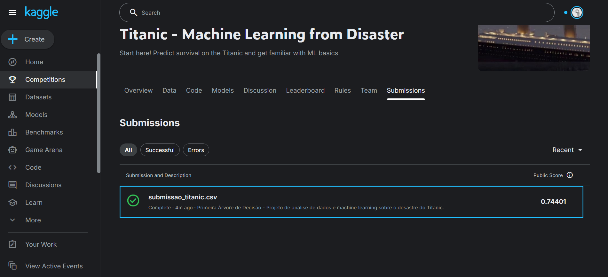

# Análise de Dados do Titanic 🚢

Projeto de análise de dados e machine learning sobre o desastre do Titanic.

## Ferramentas Utilizadas
- **Python (Pandas, Seaborn):** Limpeza e análise exploratória.
- **Power BI:** Dashboard interativo para visualização dos sobreviventes.

## Principais Insights
- Mulheres tiveram 74% de chance de sobrevivência.
- Passageiros da 1ª classe foram priorizados.

## 🤖 Resultados do Modelo de Machine Learning

Utilizamos um algoritmo de **Árvore de Decisão (Decision Tree)** para prever a sobrevivência.

- **Acurácia nos dados de treino:** ~75%
- **Score Oficial (Kaggle):** 0.74401 (Top 74% de acerto em dados nunca vistos).

### Matriz de Decisão
O modelo identificou que **Sexo**, **Classe** e **Idade** foram os fatores determinantes.

*(Adicione o print do seu score aqui)*

## 🛠️ Tecnologias
- Python 3.13
- Pandas & NumPy
- Scikit-learn
- Power BI